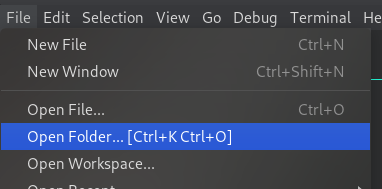
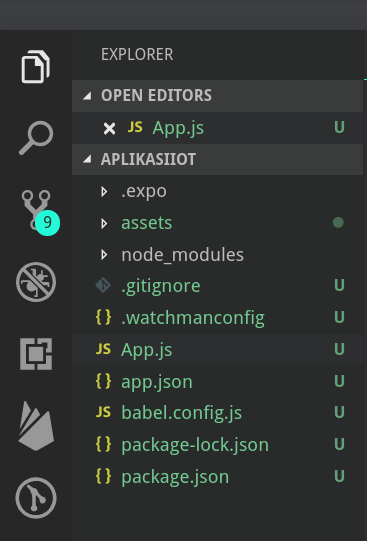
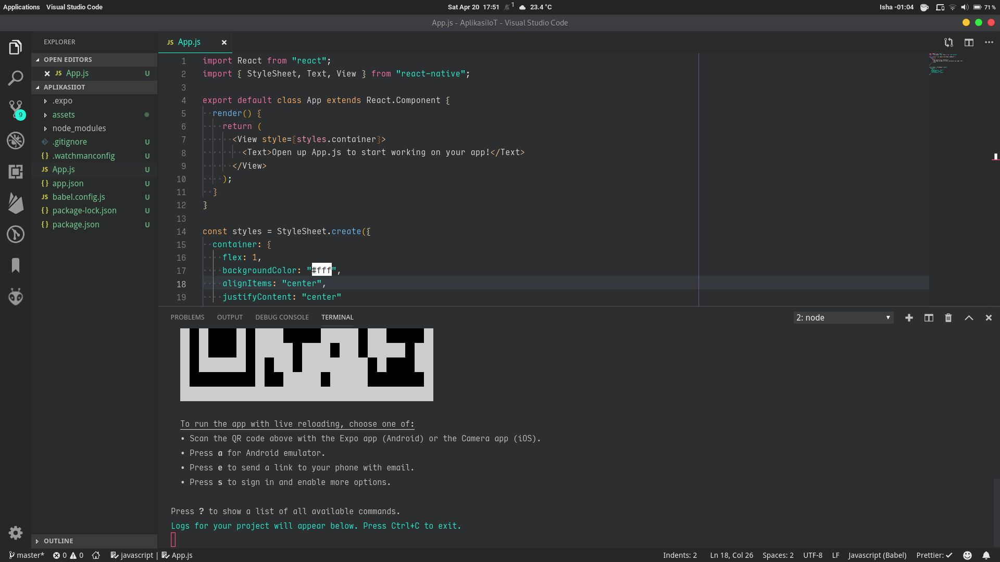
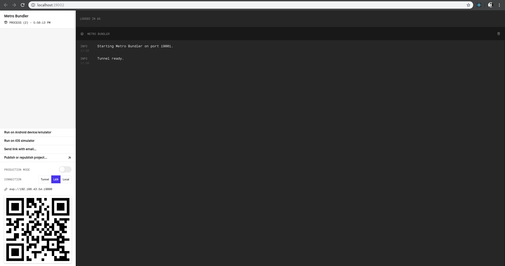
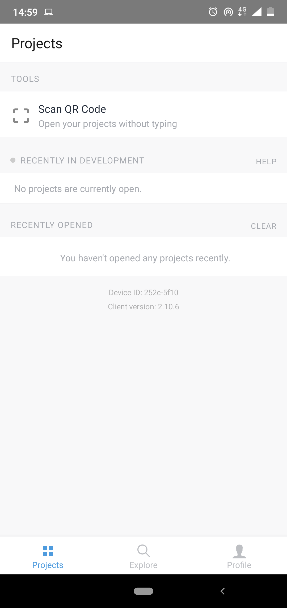
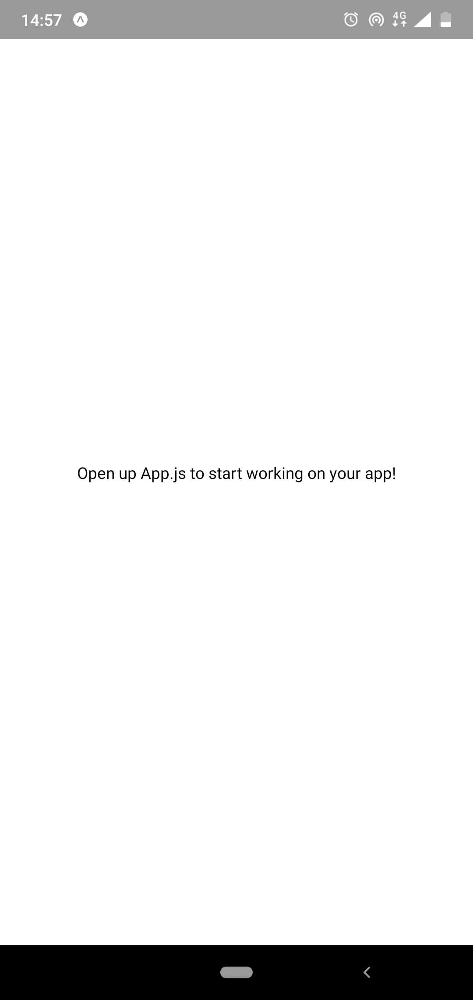

# Mempersiapkan Code Editor dan Perangkat Android

1. Buka Visual Studio Code
2. `File` > `Open Folder` > Pilih folder proyek React Native yang telah dibuat sebelumnya.

   <center></center>

3. Setelah itu akan muncul beberapa file/folder pada bilah sebelah kiri, atau jika tidak ada dapat ditampilkan dengan
   menekan icon `Explorer` (yang paling atas).

   <center></center>

4. Buka Command Prompt/Terminal yang ada pada Visual Studio Code, dengan menekan `ctrl + ~` atau pada `View` > `Terminal`, lalu
   ketikkan

   ```
   expo start
   ```

   syntax diatas dipanggil untuk menjalankan aplikasi, yang nantinya dapat
   dibuka di Perangkat android.

5. Tunggu hingga muncul tab baru pada web browser dan **QR Code** pada Terminal.
   
   
6. Pastikan perangkat android terhubung ke internet yang sama dengan laptop/pc,
   Kemudian scan **QR Code** menggunakan aplikasi **Expo Client**
   <center></center>
7. Tunggu hingga proses selesai.
8. Jika sudah maka **Aplikasi Starter** dari **Expo** akan
   muncul di perangkat android.
   <center></center>

[Selanjutnya](android_expo_coding_2.md)
