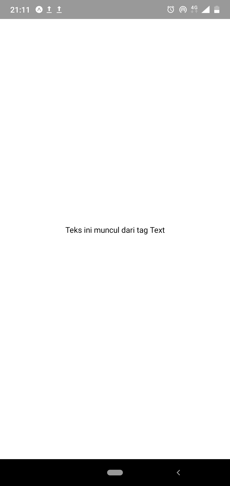
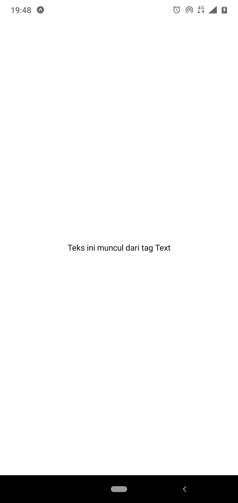

# Mencoba Hot Reload

> **Hot Reload** adalah fitur yang ada pada React Native, dengan **Hot Reload**
> pembangunan aplikasi mobile dapat dilakukan lebih cepat. Setiap kali melakukan
> save pada file aplikasi, Aplikasi yang sedang dijalankan pada emulator maupun
> pada **Expo Client** akan melakukan _reload_ untuk mengimplementasikan
> perubahan.

Buka file `App.js`

File `App.js` adalah file utama aplikasi, ketika aplikasi dijalankan maka segala
fungsi yang ada di file `App.js`akan di render terlebih dahulu. File `App.js`
awal akan berisi kode seperti ini:

```jsx
import React from "react";
import { StyleSheet, Text, View } from "react-native";
export default class App extends React.Component {
  render() {
    return (
      <View style={styles.container}>
        <Text>Open up App.js to start working on your app!</Text>
      </View>
    );
  }
}
const styles = StyleSheet.create({
  container: {
    flex: 1,
    backgroundColor: "#fff",
    alignItems: "center",
    justifyContent: "center"
  }
});
```

Perhatikan syntax di bawah.

```jsx
<Text>Open up App.js to start working on your app!</Text>
```

Syntax dengan tag `<Text/>` berfungsi untuk menampilkan teks pada halaman aplikasi.
Coba ganti kata-kata yang ada di dalam tag tersebut, Sehingga file `App.js` menjadi seperti di bawah ini,
kemudian save lalu perhatikan perubahannya.

```jsx
import React from "react";
import { StyleSheet, Text, View } from "react-native";
export default class App extends React.Component {
  render() {
    return (
      <View style={styles.container}>
        <Text> Teks ini muncul dari tag Text </Text>
      </View>
    );
  }
}
const styles = StyleSheet.create({
  container: {
    flex: 1,
    backgroundColor: "#fff",
    alignItems: "center",
    justifyContent: "center"
  }
});
```

   <center></center>

Pada aplikasi starter Expo ini, komponen status bar di android masih perlu diperbaiki.
Karena jika tidak, komponen yang ditempatkan di paling atas halaman aplikasi akan
terhalang oleh status bar.

Untuk memperbaikinya, buka file `App.json`
lalu tambahkan beberapa syntax berikut,

```json
    "androidStatusBarColor": "#ffffff",
    "androidStatusBar": {
      "barStyle": "dark-content",
      "backgroundColor": "#ffffff"
    }
```

file `App.json` setelah ditambah syntax diatas, menjadi seperti ini

```json
{
  "expo": {
    "name": "Aplikasi IoT",
    "slug": "AplikasiIoT",
    "privacy": "public",
    "sdkVersion": "32.0.0",
    "platforms": ["ios", "android"],
    "version": "1.0.0",
    "orientation": "portrait",
    "icon": "./assets/icon.png",
    "splash": {
      "image": "./assets/splash.png",
      "resizeMode": "contain",
      "backgroundColor": "#ffffff"
    },
    "updates": {
      "fallbackToCacheTimeout": 0
    },
    "assetBundlePatterns": ["**/*"],
    "ios": {
      "supportsTablet": true
    },
    "androidStatusBarColor": "#ffffff",
    "androidStatusBar": {
      "barStyle": "dark-content",
      "backgroundColor": "#ffffff"
    }
  }
}
```

Kemudian save, untuk mengaplikasikan perubahan di file `app.json` kita perlu menutup seluruh
aplikasi expo client di perangkat andorid, baik itu aplikasi android yang sedang
dibangun begitu juga dengan aplikasi expo client-nya.

Setelah di tutup, buka kembali aplikasi expo client di perangkat android.
Kemudian scan ulang QR Code pada terminal/browser. Setelah muncul, aplikasi akan
menjadi seperti ini.

   <center></center>

[Selanjutnya](android_expo_coding_3.md)
