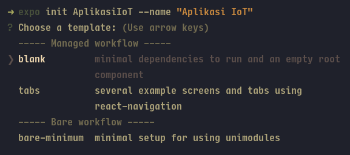
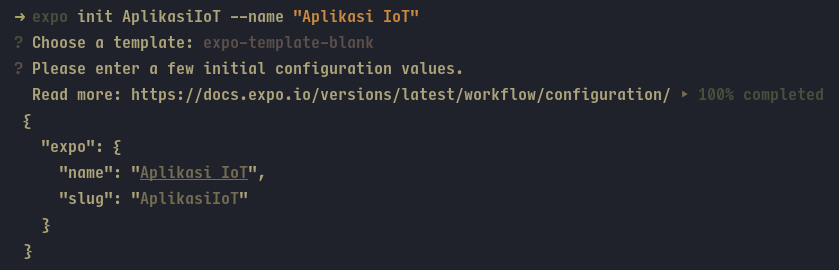
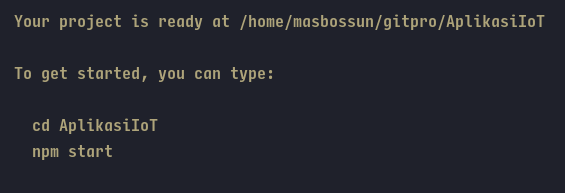
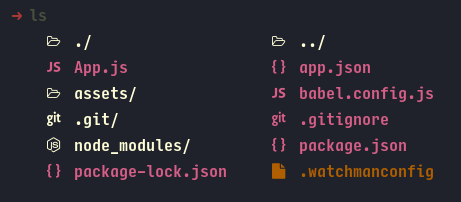

# Membuat Proyek Baru

Pada sesi ini kita akan mulai membuat proyek untuk membangun aplikasi
android menggunakan framework React Native.

#### Buat folder baru

> tip: Lebih baik membuat proyek di tempat yang mudah dijangkau seperti di
> direktori D:/ kemudian dibuat satu folder khusus untuk menyimpan banyak proyek
> didalamnya.

Buka Windows Explorer kemudian buat folder baru di direktori `D:/` atau di
tempat lain. Beri nama `MyProject` (atau bisa dengan nama lain).

#### Buat Proyek Expo

1. Buka CMD
2. Arahkan ke folder proyek yang telah dibuat pada poin sebelumnya.

```
cd D:\MyProject
```

3. Ketikkan syntax berikut, untuk membuat proyek React Native

```
expo init AplikasiIoT --name "Aplikasi IoT"
```

Pada syntax diatas `AplikasiIoT` merupakan nama untuk aplikasi yang akan dibuat.
Nama tersebut dapat diganti dengan catatan, nama tidak boleh memilki spasi
(misal: `MyApplicationNameIsGood`). Pada `--name` prefix di isi dengan nama
aplikasi yang nantinya muncul sebagai nama yang terlihat di Home Screen
android, disini namanya dapat memiliki spasi namun jangan lupa untuk
menggunakan tanda petik (misal: `"My Application Name Is Good"`)

4. Jika muncul pertanyaan untuk memilih template, pilih `blank`, lalu tekan enter

   

5. Jika muncul pertanyaan untuk konfigurasi nama, tekan enter

   

6. Tunggu hingga proses selesai.
7. Jika selesai maka akan muncul pernyataan seperti ini,

   

8. Jika proses selesai tanpa error, maka pada folder `MyProject` terdapat folder
   baru dengan nama `AplikasiIoT` (atau nama lain yang dibuat pada poin 3).
9. Masuk ke folder `AplikasiIoT` dengan syntax,

```
cd AplikasiIoT
```

10. ketik `ls` pada CMD lalu enter, akan tampil isi dari folder `AplikasiIoT` yang kurang lebih isinya akan seperti ini,

    

---

Dengan berhasilnya membuat proyek React Native dengan Expo ini maka sudah bisa
melanjutkan ke tahap berikutnya yaitu [penulisan kode](android_expo_coding.md)
