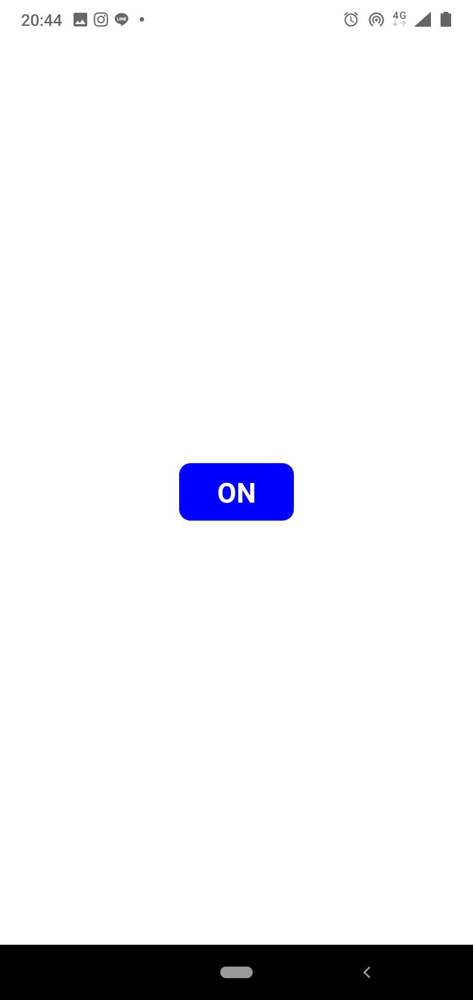
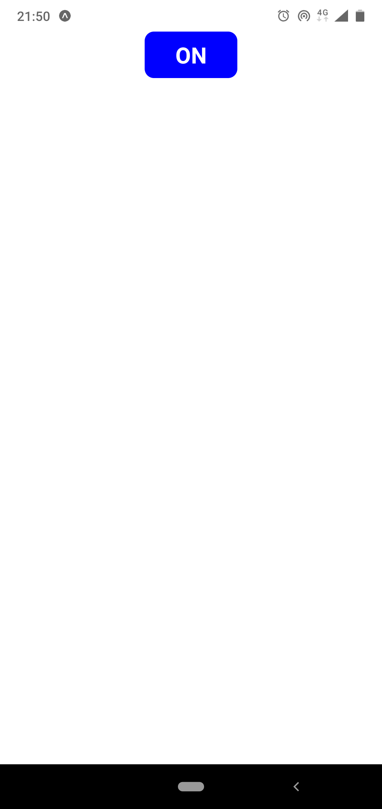
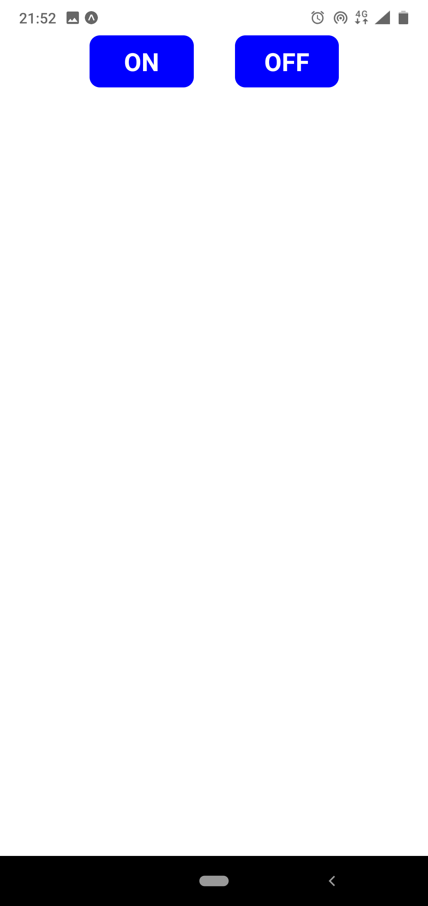
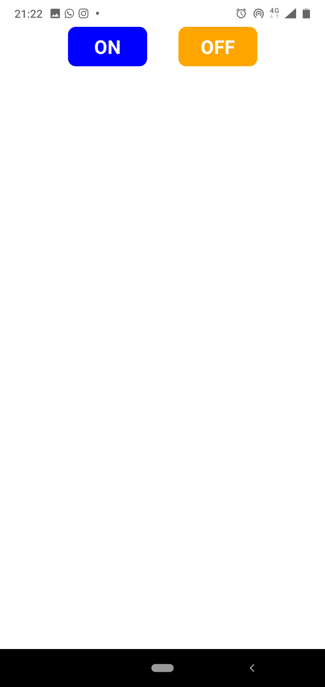
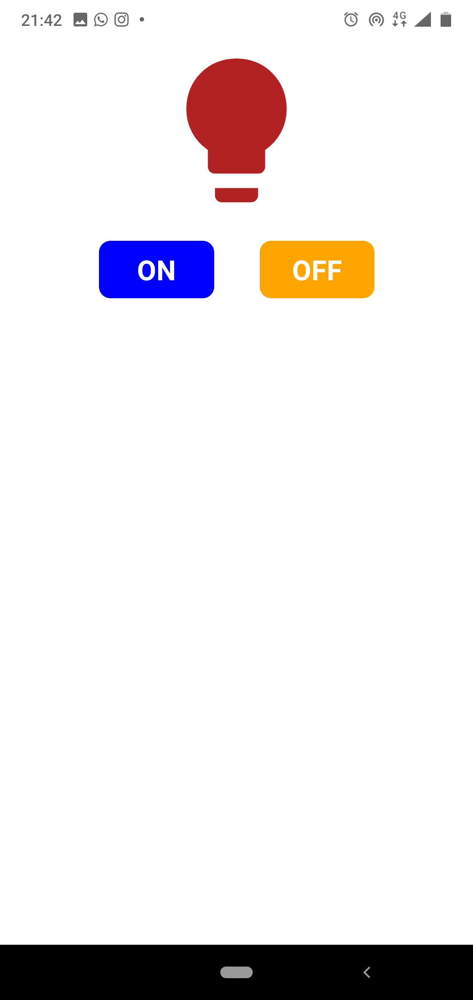

# Membuat Tombol dan Lampu

Masih pada file `App.js`, hapus komponen teks dan tambahkan syntax untuk membuat
komponen tombol.

```jsx
// Tambahkan Komponen TouchableNativeFeedback
import { StyleSheet, Text, View, TouchableNativeFeedback } from "react-native";
```

copy kode di bawah,

```jsx
<TouchableNativeFeedback>
  <View style={styles.buttonStyle}>
    <Text style={styles.buttonText}>ON</Text>
  </View>
</TouchableNativeFeedback>
```

paste ke dalam halaman kontainer di tag `<View>`

```jsx
import React from "react";
import { StyleSheet, Text, View, TouchableNativeFeedback } from "react-native";

export default class App extends React.Component {
  render() {
    return (
      <View style={styles.container}>
        <TouchableNativeFeedback>
          <View style={styles.buttonStyle}>
            <Text style={styles.buttonText}>ON</Text>
          </View>
        </TouchableNativeFeedback>
      </View>
    );
  }
}

const styles = StyleSheet.create({
  container: {
    flex: 1,
    backgroundColor: "#fff",
    alignItems: "center",
    justifyContent: "center"
  }
});
```

Tag `<View/>` bekerja seperti `<div>` pada HTML yang sifatnya
sebagai _container_ untuk komponen lainnya. Dengan tag `<View>` kita dapat
membuat berbagai bentuk atau komponen secara bebas.

Tag `<TouchableNativeFeedback>` adalah sebuah tag untuk membungkus komponen agar
memiliki fungsi klik atau sentuh.

Tag `<Text>` digunakan untuk me-render teks.

Hampir setiap komponen memiliki property `style` untuk memberikan gaya pada
komponen. Biasanya kode untuk `style` dipisahkan agar `codebase` lebih rapi.
Perhatikan kode tombol yang di buat sebelumnya. Di tag `<View>` dan `<Text>` nya
memiliki property style, namun sebenarnya tidak ada styling yang dibuat untuk
mereka. Jadi kita perlu tambahkan kode style bersamaan dengan kode style lainnya.

```jsx
const styles = StyleSheet.create({
  container: {
    flex: 1,
    backgroundColor: "#fff",
    alignItems: "center",
    justifyContent: "center"
  },
  buttonStyle: {
    height: 50, // tinggi komponen
    width: 100, // lebar komponen
    borderRadius: 10, // besar sudut komponen
    backgroundColor: "blue", // warna background komponen
    justifyContent: "center", // perataan vertical item di dalam komponen
    alignItems: "center", // perataan horizontal item di dalam komponen
    marginHorizontal: 20 // jarak kanan dan kiri
  },
  buttonText: {
    fontSize: 24, // ukuran font
    fontWeight: "bold", // jenis font
    color: "white" // warna font
  }
});
```

sehingga hasilnya menjadi seperti ini

```jsx
import React from "react";
import { StyleSheet, Text, View, TouchableNativeFeedback } from "react-native";

export default class App extends React.Component {
  render() {
    return (
      <View style={styles.container}>
        <TouchableNativeFeedback>
          <View style={styles.buttonStyle}>
            <Text style={styles.buttonText}>ON</Text>
          </View>
        </TouchableNativeFeedback>
      </View>
    );
  }
}

const styles = StyleSheet.create({
  container: {
    flex: 1,
    backgroundColor: "#fff",
    alignItems: "center",
    justifyContent: "center"
  },
  buttonStyle: {
    height: 50,
    width: 100,
    borderRadius: 10,
    backgroundColor: "blue",
    justifyContent: "center",
    alignItems: "center",
    marginHorizontal: 20
  },
  buttonText: {
    fontSize: 24,
    fontWeight: "bold",
    color: "white"
  }
});
```

Variable `styles` yang ada di paling bawah file `App.js` berisi variable untuk
gaya komponen. Variable `styles` ini berbentuk object, contohnya pada file `App.js` sudah terdapat style `container`
sebagai gaya untuk container dari halaman aplikasi.

Di React Native _styling_ yang digunakan sama seperti `CSS` pada web, namun
penulisan property-nya sedikit berbeda, jika pada `CSS` nama property dipisahkan
dengan tanda `-` dan semua karakternya tidak ada kapital, sedangkan nama
property `style` pada React Native berbentuk `camelCase`, dimana pemisah
kata-nya adalah huruf kapital di kata ke-2 dan kata berikutnya. Contoh di `CSS` bernama
`background-color` sedangkan di React Native bernama
`backgroundColor`.

   <center></center>

---

Secara default React Native menggunakan `display: flex` pada seluruh komponen
style atau biasa disebut dengan _flexbox_

sekarang coba hapus property `justifyContent` pada container di `App.js`

```jsx
container: {
    flex: 1,
    backgroundColor: "#fff",
    alignItems: "center",
    justifyContent: "center" // hapus
  },
```

save lalu lihat perubahannya.

   <center></center>

Tombol yang tadinya berada di tengah halaman, sekarang berpindah ke atas. Ini
disebabkan karena kita menghapus property `justifyContent` pada komponen container.

property `justifyContent` berfungsi untuk menentukan perataan `item` yang berada
di dalam kontainer secara _vertical_.

---

Buat satu tombol lagi untuk tombol `OFF`

```jsx
<TouchableNativeFeedback>
  <View style={styles.buttonStyle}>
    <Text style={styles.buttonText}>OFF</Text>
  </View>
</TouchableNativeFeedback>
```

Kurang lebih sama seperti tombol `ON` hanya saja pada text kita rubah menjadi
`OFF`, tempatkan tepat dibawah tombol `ON`

```jsx
...
<View style={styles.container}>
  <TouchableNativeFeedback>
    <View style={styles.buttonStyle}>
      <Text style={styles.buttonText}>ON</Text>
    </View>
  </TouchableNativeFeedback>
  <TouchableNativeFeedback>
    <View style={styles.buttonStyle}>
      <Text style={styles.buttonText}>OFF</Text>
    </View>
  </TouchableNativeFeedback>
</View>
...
```

Buat kedua tombol sejajar secara horizontal, dengan membuat tag `<View>` sebagai
kontainer tombol.

```jsx
...
<View style={styles.container}>

  <View style={styles.buttonContainer}>

    <TouchableNativeFeedback>
      <View style={styles.buttonStyle}>
        <Text style={styles.buttonText}>ON</Text>
      </View>
    </TouchableNativeFeedback>
    <TouchableNativeFeedback>
      <View style={styles.buttonStyle}>
        <Text style={styles.buttonText}>OFF</Text>
      </View>
    </TouchableNativeFeedback>

  </View>

</View>
...
```

tambahkan styling untuk kontainer tombol,

```jsx
buttonContainer: {
  flexDirection: "row", // arah perataan menjadi horizontal
}
```

   <center></center>

---

Ganti warna tombol `OFF`, untuk membedakannya dengan tombol `ON`

bedakan styling untuk tombol on dan off, begitu juga pada property di tag
`<View>`.

```jsx
...
  <TouchableNativeFeedback>
    {/* menjadi buttonStyleON */}
    <View style={styles.buttonStyleON}>
      <Text style={styles.buttonText}>ON</Text>
    </View>
  </TouchableNativeFeedback>
  <TouchableNativeFeedback>
    {/* menjadi buttonStyleOFF */}
    <View style={styles.buttonStyleOFF}>
      <Text style={styles.buttonText}>OFF</Text>
    </View>
  </TouchableNativeFeedback>
...
```

```jsx
const styles = StyleSheet.create({
  container: {
    flex: 1,
    backgroundColor: "#fff",
    alignItems: "center"
  },

  // menjadi buttonStyleON
  buttonStyleON: {
    height: 50,
    width: 100,
    borderRadius: 10,
    backgroundColor: "blue",
    justifyContent: "center",
    alignItems: "center",
    marginHorizontal: 20
  },

  // style baru buttonStyleOFF
  buttonStyleOFF: {
    height: 50,
    width: 100,
    borderRadius: 10,
    backgroundColor: "orange", // membedakan warna, menjadi `orange`
    justifyContent: "center",
    alignItems: "center",
    marginHorizontal: 20
  },
  buttonText: {
    fontSize: 24,
    fontWeight: "bold",
    color: "white"
  },
  buttonContainer: {
    flexDirection: "row"
  }
});
```

   <center></center>

---

Tambahkan icon lampu di atas tombol

Gunakan komponen icon yang sudah _built in_ dari `expo`, daftar dari icon yang
dapat digunakan dapat dilihat [disini](https://expo.github.io/vector-icons/)

pertama _import_ terlebih dahulu,

```jsx
import Icon from "@expo/vector-icons/MaterialCommunityIcons";
```

`MaterialCommunityIcons` adalah jenis atau pembuat set icon, masih banyak
lagi jenis lain mulai dari `FontAwesome`, `FeatherIcon`, dll

kemudian tambahkan komponen dengan tag `<Icon>` di atas kontainer tombol.

```jsx
<Icon
  name="lightbulb"
  size={150}
  style={{ color: "firebrick", marginBottom: 20 }}
/>
```

Property pada tag `<Icon>` antara lain ada:

- `name` untuk nama icon yang akan
  ditampilkan, nama icon ini harus sesuai dengan nama [disini](https://expo.github.io/vector-icons/).
  Kali ini kita menggunakan icon lampu dengan nama `lightbulb` dari
  `MaterialCommunityIcons`.
- `size` di isi nomor untuk ukuran dari icon
- `style` untuk styling dari icon.

> Jika diperhatikan property `style` juga dapat ditulis secara `inline`

---

Hasil akhirnya file `App.js` menjadi seperti ini.

```jsx
import React from "react";
import { StyleSheet, Text, View, TouchableNativeFeedback } from "react-native";
import Icon from "@expo/vector-icons/MaterialCommunityIcons";

export default class App extends React.Component {
  render() {
    return (
      <View style={styles.container}>
        <Icon
          name="lightbulb"
          size={150}
          style={{ color: "firebrick", marginBottom: 20 }}
        />
        <View style={styles.buttonContainer}>
          <TouchableNativeFeedback>
            <View style={styles.buttonStyleON}>
              <Text style={styles.buttonText}>ON</Text>
            </View>
          </TouchableNativeFeedback>
          <TouchableNativeFeedback>
            <View style={styles.buttonStyleOFF}>
              <Text style={styles.buttonText}>OFF</Text>
            </View>
          </TouchableNativeFeedback>
        </View>
      </View>
    );
  }
}

const styles = StyleSheet.create({
  container: {
    flex: 1,
    backgroundColor: "#fff",
    alignItems: "center"
  },
  buttonStyleON: {
    height: 50,
    width: 100,
    borderRadius: 10,
    backgroundColor: "blue",
    justifyContent: "center",
    alignItems: "center",
    marginHorizontal: 20
  },
  buttonStyleOFF: {
    height: 50,
    width: 100,
    borderRadius: 10,
    backgroundColor: "orange",
    justifyContent: "center",
    alignItems: "center",
    marginHorizontal: 20
  },
  buttonText: {
    fontSize: 24,
    fontWeight: "bold",
    color: "white"
  },
  buttonContainer: {
    flexDirection: "row"
  }
});
```

dan tampilan aplikasinya menjadi seperti ini.

   <center></center>

[Selanjutnya](android_expo_coding_4.md)
