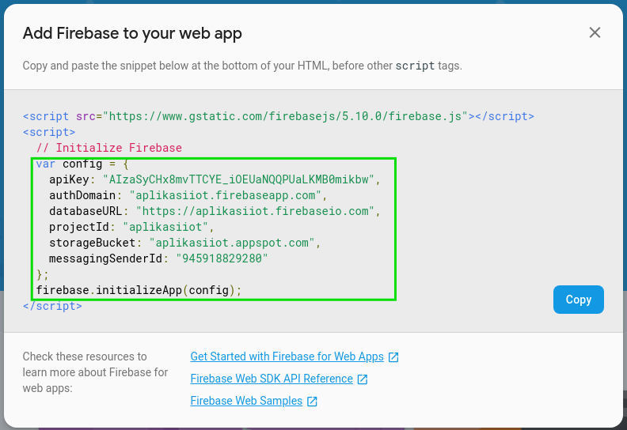

# Integrasi Firebase di Aplikasi Android

#### Setup Firebase

1. Pada terminal di **Visual Studio Code**, arahkan dan klik di dalam terminal lalu tekan `Ctrl+\` pada keyboard.
   Atau Pada menu **Visual Studio Code** Klik `Terminal` > `Split Terminal`.
   Akan keluar terminal baru di sebelah terminal yang ada.

2. Di terminal baru, ketikkan perintah di bawah, lalu enter.

```bash
npm install --save firebase
```

3. Tunggu proses instalasi selesai.

4. Pada bagian dashboard awal firebase, atau klik **Project Overview** di sisi kiri dashboard

5. Klik logo web dengan icon `</>`,

   <center></center>

6. Akan muncul data atau identitas dari proyek firebase.

   <center></center>

7. Copy kode yang ditandai, kemudian pada file `App.js` di paste di atas kode
   `export default class App ...`

8. Kemudian di paling atas file `App.js` masukkan syntax di bawah untuk
   meng-import module firebase.

```jsx
import * as firebase from "firebase";
```

sehingga file `App.js` menjadi seperti ini.

```jsx
import React from "react";
import { StyleSheet, Text, View, TouchableNativeFeedback } from "react-native";
import Icon from "@expo/vector-icons/MaterialCommunityIcons";
import * as firebase from "firebase";

var config = {
  apiKey: " ", // isi sesuai identitas dari firebase
  authDomain: " ", // isi sesuai identitas dari firebase
  databaseURL: " ", // isi sesuai identitas dari firebase
  projectId: " ", // isi sesuai identitas dari firebase
  storageBucket: " ", // isi sesuai identitas dari firebase
  messagingSenderId: " " // isi sesuai identitas dari firebase
};
firebase.initializeApp(config);

export default class App extends React.Component {
  render() {
    return (
      <View style={styles.container}>
        <Icon
          name="lightbulb"
          size={150}
          style={{ color: "firebrick", marginBottom: 20 }}
        />
        <View style={styles.buttonContainer}>
          <TouchableNativeFeedback>
            <View style={styles.buttonStyleON}>
              <Text style={styles.buttonText}>ON</Text>
            </View>
          </TouchableNativeFeedback>
          <TouchableNativeFeedback>
            <View style={styles.buttonStyleOFF}>
              <Text style={styles.buttonText}>OFF</Text>
            </View>
          </TouchableNativeFeedback>
        </View>
      </View>
    );
  }
}

const styles = StyleSheet.create({
  container: {
    flex: 1,
    backgroundColor: "#fff",
    alignItems: "center"
  },
  buttonStyleON: {
    height: 50,
    width: 100,
    borderRadius: 10,
    backgroundColor: "blue",
    justifyContent: "center",
    alignItems: "center",
    marginHorizontal: 20
  },
  buttonStyleOFF: {
    height: 50,
    width: 100,
    borderRadius: 10,
    backgroundColor: "orange",
    justifyContent: "center",
    alignItems: "center",
    marginHorizontal: 20
  },
  buttonText: {
    fontSize: 24,
    fontWeight: "bold",
    color: "white"
  },
  buttonContainer: {
    flexDirection: "row"
  }
});
```

---

#### Read Write Data Firebase

Pada file `App.js`, masukkan kode ini, di atas syntax `render()`

```jsx
constructor(props){
    super(props);
    this.state = {
      warnaLampu: "black"
    }
  }
```

Pada kode di atas, kita membuat sebuah variable yang nilainya dapat mempengaruhi
aplikasi dalam bekerja yang disebut dengan `state`. Yang pertama kita buat adalah variabel `warnaLampu` untuk
mendefinisikan warna dari icon lampu.

Untuk mengimplementasikan `state` pada pada icon lampu, kita rubah nilai dari
style `color` dari string statis menjadi variable dari `state` `warnaLampu`.
Rubah kode icon lampu menjadi seperti ini

```jsx
<Icon
  name="lightbulb"
  size={150}
  style={{ color: this.state.warnaLampu, marginBottom: 20 }}
/>
```

> Jika diperhatikan, untuk mengambil nilai atau variabel `state` ditulis dengan
> syntax `this.state.[nama dari variabel]`.

Copy kode di bawah dan tempatkan di atas syntax `render()`

```jsx
componentDidMount(){
  firebase.database().ref("lampu/").on("value", (snapshot) => {
    console.log(snapshot.val())
  })
}
```

Fungsi `componentDidMount()` pada **React Native** digunakan sebagai pengeksekusi
perintah tepat disaat halaman aplikasi ter-render.

Di dalam fungsi `componentDidMount()` kita memanggil fungsi dari firebase untuk membaca data dari
database. Pada kode di atas method `ref()` parameternya harus di isi dengan nama atau alamat dari parent pada
database firebase. Karena pada sesi sebelumnya kita telah membuat sebuah parent
di database firebase dengan nama `"lampu"` maka kali ini kita isi method `ref()` dengan string `"lampu/"`.

> console.log() berguna untuk menampilkan pesan di console. Biasanya digunakan
> untuk memperlihatkan nilai dari sebuah variabel yang tidak diketahui
