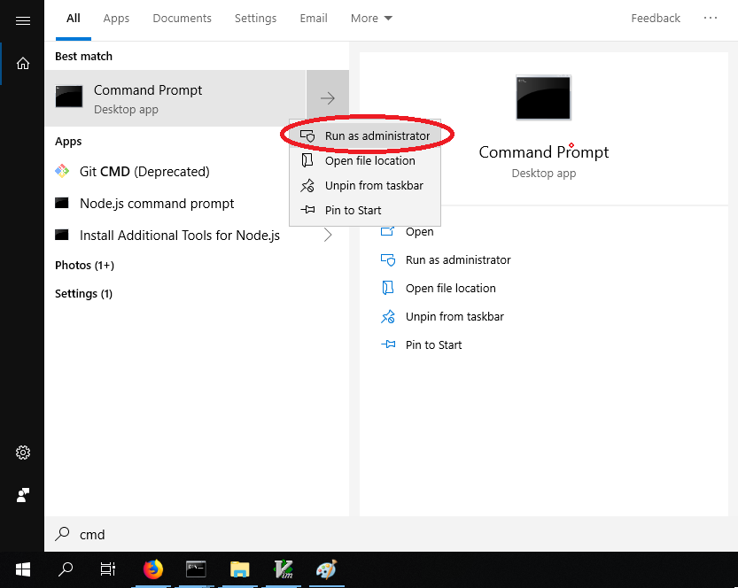

# Android

Pada modul ini akan dijelaskan pembuatan aplikasi mobile khususnya Android menggunakan _framework cross-platform_ **React Native**. Modul atau dokumentasi ini seluruhnya di dapat dari [sumber asli](https://facebook.github.io/react-native/docs/getting-startead).

**React Native** adalah sebuah _framework_ untuk membangun aplikasi mobile. Framework
ini dikembangkan secara _open source_ oleh facebook dan komunitas di github.
Dengan React Native kita dapat membangun aplikasi mobile untuk **Android** maupun
**iO**S hanya dengan satu codebase saja. Untuk membangun aplikasi iOS kita perlu
menggunakan Sistem Operasi **macOS**, namun untuk membangun aplikasi Android kita
bisa menggunakan Sistem Operasi apa pun. Pada React Native bahasa pemrograman
yang digunakan adalah **JavaScript**.

#### Keluaran yang diharapkan pada sesi ini adalah:

- Berhasil menginstall Chocolatey
- Berhasil menginstall NodeJS
- Berhasil menginstall Git
- Berhasil menginstall Expo
- Berhasil menginstall Visual Studio Code
- Berhasil menginstall Expo Client di perangkat smartphone

# Persyaratan Sistem

- PC atau Laptop yang terhubung dengan internet.
- **Sistem Operasi**: Windows 7 SP1 atau terbaru (64-bit)
- **Alat yang diperlukan** :
  - Smartphone Android atau iOS
  - Windows Command Propmt (CMD) atau Windows PowerShell, pastinya sudah terinstall secara default.
- Internet 

### ===Perhatian!!===
> Semua langkah-langkah di bawah membutuhkan koneksi internet, jadi harap untuk memastikan bahwa anda memiliki koneksi internet selama menjalani proses di bawah.

# Pendahuluan

> Untuk memulai CMD dengan mode administrator, bisa dengan mencari **cmd** pada Windows search, lalu klik kanan dan pilih **Run as administrator**


#### Instalasi Chocolatey

Chocolatey adalah sebuah Package Manager di Windows untuk instalasi aplikasi
atau package lewat CLI (Command Line Interface) di Command Prompt. Pada Sistem Operasi lain
seperti linux hal seperti ini biasa dilakukan pada terminal. Keterangan lebih
lanjut dapat dilihat [disini](https://chocolatey.org/)

1. Buka CMD as Administrator
2. Copy Paste kode di bawah ke dalam CMD

```
@"%SystemRoot%\System32\WindowsPowerShell\v1.0\powershell.exe" -NoProfile -InputFormat None -ExecutionPolicy Bypass -Command "iex ((New-Object System.Net.WebClient).DownloadString('https://chocolatey.org/install.ps1'))" && SET "PATH=%PATH%;%ALLUSERSPROFILE%\chocolatey\bin"
```

3. Enter, kemudian tunggu hingga proses instalasi selesai.
4. Close CMD
5. Untuk memastikan instalasi chocolatey berhasil, buka CMD baru kemudian
   ketikkan `choco --version` jika muncul versi dari chocolatey maka chocolatey
   sudah dapat digunakan.

#### Instalasi NodeJS

Node.js adalah environment run-time JavaScript berbentuk Open Source dan Cross Platform yang dapat mengeksekusi kode JavaScript di luar browser.

1. Buka CMD as Administrator
2. Install NodeJS dengan kode di bawah

```
choco install nodejs
```

3. Tunggu proses instalasi selesai
4. Close CMD
5. Buka CMD baru lalu ketikkan `node --version` , jika
   outputnya menampilkan versi dari NodeJS maka instalasi NodeJS berhasil.

#### Instalasi Git 
Git merupakan software version control yang bertujuan untuk manajemen software. Kali ini kita tidak akan menggunakan git, namun hanya sebagai prasyarat saja untuk menjalankan langkah-langkah selajutnya.

1. Buka CMD as Administrator
2. Install Git dengan kode di bawah

```
choco install git.install
```

3. Tunggu proses instalasi selesai
4. Close CMD
5. Buka CMD baru lalu ketikkan `git --version` , jika
   outputnya menampilkan versi dari Git maka instalasi Git berhasil.


#### Instalasi Expo

Expo adalah alat bantu untuk membuat aplikasi mobile dengan basis React
Native. Expo dibuat oleh komunitas sebagai starter kit dan alat pengembangan
React Native

1. Buka CMD as Administrator
2. Kemudian ketikkan,

```
npm install -g expo-cli
```

3. Tunggu hingga proses selesai
4. Tutup CMD
5. Buka CMD baru ketikkan `expo --version` untuk melihat versi dari expo, jika
   muncul versinya maka instalasi berhasil.

#### Instalasi Visual Studio Code

Visual Studio Code adalah code editor layaknya Notepad++ yang dikembangkan
oleh Microsoft. Visual Studio Code atau biasa disebut VSCode sangat populer
dikalangan Software Developer. Pada VSCode juga banyak plugin atau alat untuk
memudahkan dalam penulisan kode untuk berbagai macam bahasa pemrograman

1. Buka CMD as Administrator
2. Kemudian ketikkan,

```
choco install vscode
```

3. Tunggu hingga proses selesai
4. Tutup CMD
5. Pada start menu, cari `Visual Studio Code`, jika ada maka instalasi
   berhasil.


#### Instalasi Expo Client

Expo Client adalah Aplikasi yang diinstall pada perangkat smartphone, untuk
melakukan debug atau mencoba aplikasi yang sedang dibangun.

Install Expo Client di Google Play. klik [disini](https://play.google.com/store/apps/details?id=host.exp.exponent&hl=en)

#### Pembuatan Project Expo Pertama Kali
Pertama, tentukan dulu tempat penyimpanan data project anda. Misalkan saya ingin menyimpan di drive `F:\`, maka buka CMD dan ketik `F:`, lalu tekan enter. Folder akan berpindah ke `F:`.


Ketikkan `mkdir MyProject` untuk membuat folder project, lalu masuk ke dalam folder tersebut dengan `cd MyProject`.  
Setelah itu, ketikkan `expo init AplikasiIoT --name "Aplikasi IoT"` untuk membuat project expo baru.
```
mkdir MyProject
cd MyProject
expo init AplikasiIoT --name "Aplikasi IoT"
```
Ketika diminta untuk memilih template, pilih **blank**, seterusnya tekan enter saja.
  

Setelah selesai, masuk ke project dengan `cd AplikasiIoT` dan jalankan expo dengan `expo start`.
```
cd AplikasiIoT
expo start
```
Setelah selesai, akan muncul tampilan berikut pada cmd.


#### Instalasi Firebase 
Masih di dalam folder `AplikasiIoT`, ketikkan `npm install firebase --save`.
```
npm install firebase --save
```


> Tip: Jika pada langkah di atas mendapat error, coba pastikan cmd berada pada mode administrator, dan jalankan `npm cache clean --force`. Lalu lakukan instalasi lagi.
