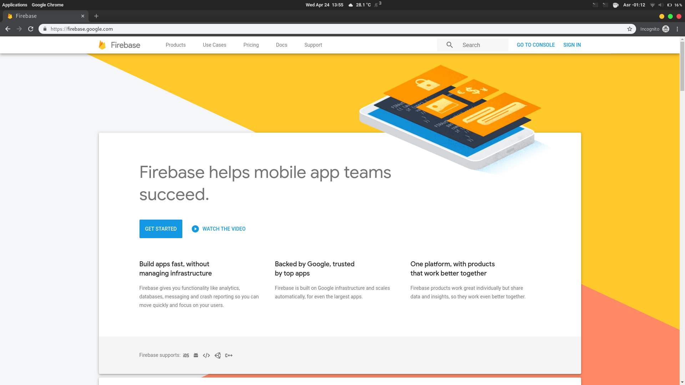
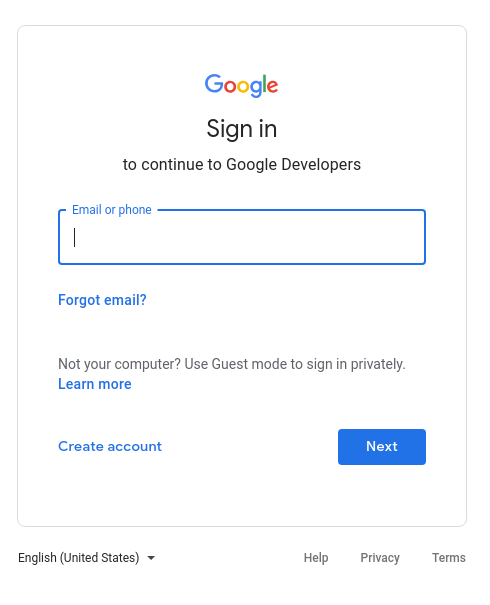
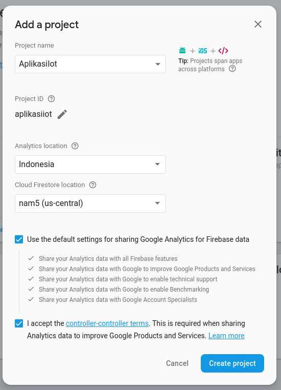
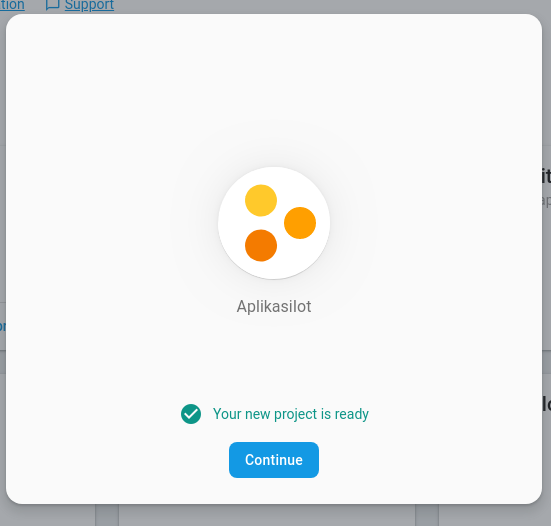
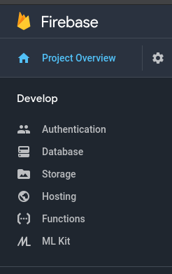
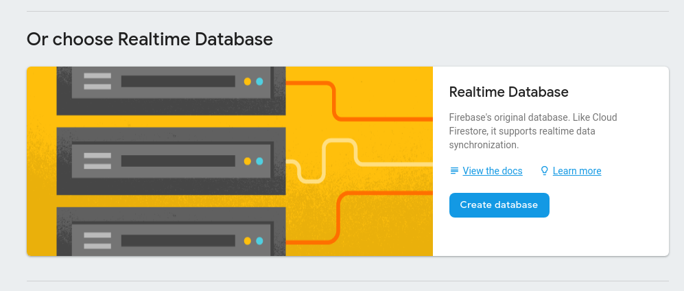
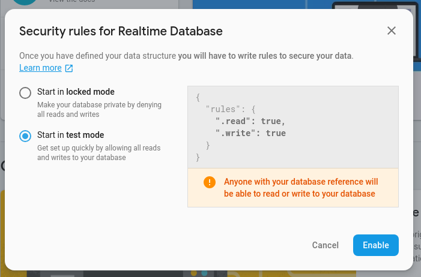
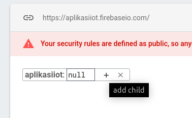
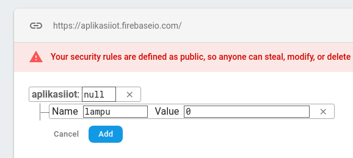
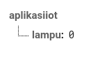

# Membuat Proyek Firebase Baru

Pada sesi ini kita akan membuat proyek baru pada firebase, yang nantinya akan
digunakan untuk menyimpan data pada Firebase Realtime Database.

#### Membuat Akun Firebase

1. Buka `firebase.google.com`
2. Pada pojok kanan atas, klik `Sign In`

   

3. **Sign In** menggunakan akun atau email **Google**

   

#### Membuat Proyek Baru

1. Pada laman awal firebase, klik `Get Started` atau pada pojok kanan atas klik
   `Go to console`
2. Pada laman _console_ firebase, pilih `Add Project`
3. Di kolom **Project Name**, masukkan nama aplikasi, misal `AplikasiIoT`, Pada
   kolom **Analytics location** pilih `Indonesia`. Pada kolom **Cloud Firestore location**
   biarkan _default_. Centang kedua _checkbox_ di bawah, kemudian klik
   **Create Project**.

   

4. Tunggu hingga proses selesai. Kemudian klik **Continue**

   

#### Mempersiapkan Realtime Database untuk Android

1. Pada sisi kiri dashboard firebase, klik **Database** di bagian **Develop**

   

2. Scroll ke bawah, pada bagian **Realtime Database**, klik **Create database**

   

3. Pilih `Start in test mode`, lalu tekan **Enable**, nanti dashboard **Realtime Database** akan terbuka.

   

4. Arahkan cursor ke database, lalu klik `add child` dengan icon `+`

   

5. Masukkan `lampu` pada kolom **Name** dan nilai `0` pada kolom **Value**,
   klik **Add**

   

6. Sehingga menjadi seperti ini.

   

---

Dengan dibuatnya database di Firebase Realtime Database, kita sudah bisa
mengggunakan database tersebut untuk menyimpan dan mengolah data.
[Selanjutnya](android_expo_create_project.md)
