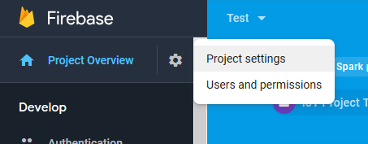
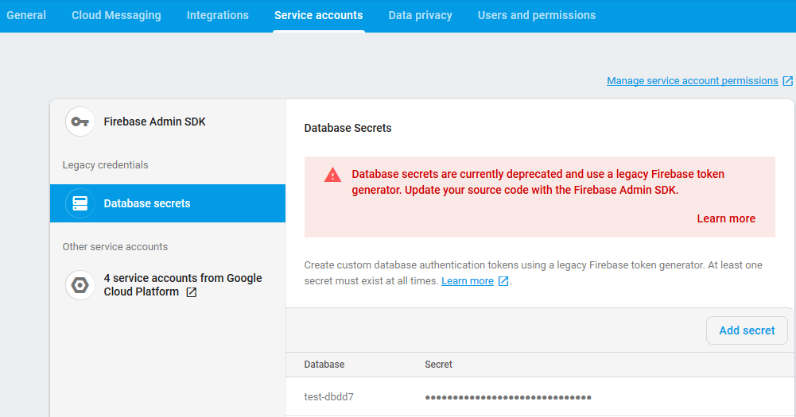

# Kode Mikrokontroler

Kode mikrokontroler berikut berfungsi untuk menyalakan dan mematikan kondisi LED pada Firebase tergantung dari penekanan tombol/push button.  
Sebelum menulis kode, siapkan beberapa hal berikut:
1. WiFi dengan SSID dan Password
2. Firebase Secret Key

Secret Key Firebase didapat dengan navigasi ke **Project Overview > Project Settings** pada Firebase.  
  

Navigasi ke tab **Service Accounts**, lalu pilih **Database Secrets**. Di sana terdapat tombol **Add Secret** untuk membuat suatu kunci rahasia agar ESP8266 dapat terkoneksi dengan Firebase Realtime Database.  



Berikut adalah kode untuk mengirim data dengan push button dan juga mengambil data pada Firebase:
```arduino
#include <ESP8266WiFi.h>
#include <FirebaseArduino.h>

#define FIREBASE_HOST "link_project_firebase"
#define FIREBASE_AUTH "kode_rahasia_firebase"
#define WIFI_SSID "nama_wifi"
#define WIFI_PASSWORD "password_wifi"

int led = D2;
int tombol = D3;

void setup() {
  Serial.begin(9600);
  pinMode(led, OUTPUT);
  pinMode(tombol, INPUT);

  // connect to wifi.
  WiFi.begin(WIFI_SSID, WIFI_PASSWORD);
  Serial.print("connecting");
  while (WiFi.status() != WL_CONNECTED) {
    Serial.print(".");
    delay(500);
  }
  Serial.println();
  Serial.print("connected: ");
  Serial.println(WiFi.localIP());
  
  Firebase.begin(FIREBASE_HOST, FIREBASE_AUTH);
}

int nilai;

void loop() {

  nilai= digitalRead(tombol);
   
  if(nilai == HIGH){
    Serial.println("ON");
    digitalWrite(led, HIGH);
    Firebase.setInt("led",1);
    Firebase.setString("tombol", "ON");
    delay(100);
  }
  else{
    Serial.println("OFF");
    digitalWrite(led, LOW);
    Firebase.setInt("led",0);
    Firebase.setString("tombol", "OFF");
    delay(100);
  }
}
```
