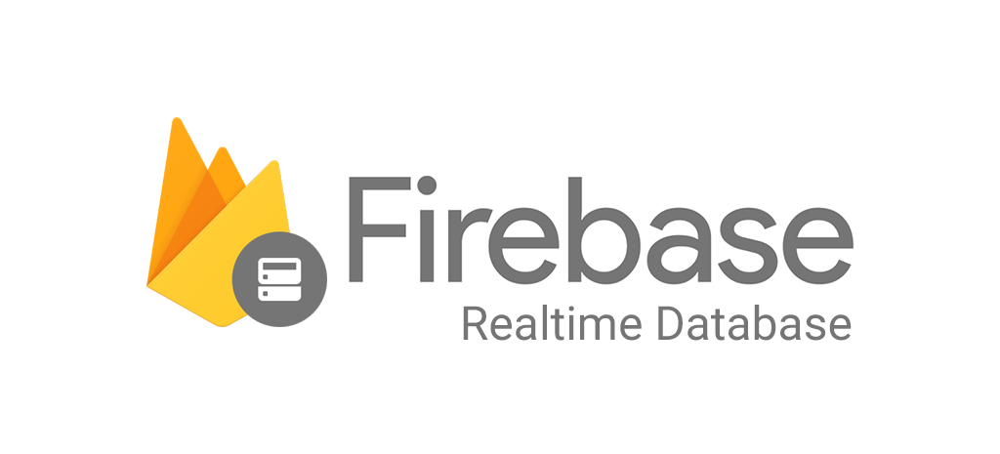

# Pendahuluan

Berikut merupakan tujuan dari modul pelatihan bidang microcontroller :
1. Dapat memahami tentang Arduino IDE
2. Dapat memahami tentang board NodeMCU ESP8266
3. Dapat memahami tentang Firebase 
4. Dapat memahami dan menghubungkan NodeMCU ke Firebase
5. Dapat mengirim dan menerima data ON/OFF LED antara NodeMCU dengan Firebase

## Arduino


Arduino adalah sebuah prototyping platform bersifat open-source (sumber terbuka) yang mudah digunakan baik secara hardware dan software.  Arduino merupakan framework yang dapat digunakan untuk berbagai macam board mikrokontroler maupun sistem minimum, diantaranya yang sering digunakan adalah:

* Arduino Uno (Mikrokontroler: ATMEGA328)
* NodeMCU (Mikrokontroler: ESP-12E)
* Bluepill (Mikrokontroler: STM32F103C8T6) 
Untuk informasi lebih spesifik terkait Arduino Uno dapat dilihat pada datasheet [berikut ini](https://www.farnell.com/datasheets/1682209.pdf).  

Selain kemudahan hardware seperti yang disebutkan di atas, Arduino juga menawarkan kemudahan dalam software dengan adanya paket pengembangan (IDE) yang bersifat universal dan dapat digunakan untuk berbagai macam jenis mikrokontroler. 
Berikut ini merupakan keuntungan dari Arduino:
* Inexpensive/Murah.
* Cross-Platform
* Mudah Digunakan.
* Open Souce at Software dan Hardware
Pemrograman arduino menggunakan bahasa pemrograman Arduino yang memiliki struktur bahasa mirip dengan C++. Berikut adalah beberapa sintaks dasar pada Arduino :

           
1. `#include`  

Untuk memanggil atau memasukkan sebuah library kedalam program. 
```cpp
#include <[nama_library]>
#include <ArduinoJson.h>
```
   
2. `#define`  

Untuk memberikan nama dan nilai pada sebuah konstanta.
```arduino
#define [nama konstanta] [nilai]
#define led 13
```

3. `void setup()`  

Blok kode yang hanya dijalankan sekali selama mikrokontroler menyala. Contoh aplikasinya adalah untuk inisialisasi mode pin (output/input), pemilihan baudrate, dll.
```arduino
void setup() {
  Serial.begin(9600);
  pinMode(13, OUTPUT);
}
```


4. `void loop()`  

Blok kode yang dijalankan secara berulang-ulang selama mikrokontroler menyala. Contoh dasarnya adalah menyala-matikan LED secara berulang-ulang (blink).

```arduino
void loop() {
  digitalWrite(led, HIGH);
  delay(500);
  digitalWrite(led, LOW);
  delay(500);
  Serial.println("Hello world!");
}
```

5. `Serial.begin`, `Serial.print` & `Serial.println`  
Digunakan untuk menampilkan hasil pemrograman pada serial monitor di Arduino IDE, data yang ditampilkan melalui `Serial.print` dan `Serial.println` dapat berupa karakter atau angka. Perbedaannya adalah pada `Serial.print` akan menampilkan hasil kedalam satu baris, sedangkan `Serial.println` akan menampilkan hasil dalam bentuk baris baru.  
Sebelum melakukan `Serial.print` atau `Serial.println`, baudrate harus diatur terlebih dahulu baik di `setup` atau `loop` dengan perintah `Serial.begin` dengan baudrate tertentu.

Baudrate yang sering digunakan:
* 9600
* 115200
* 57600
* 921600

## NodeMCU ESP8266 
NodeMCU adalah sebuah platform IoT yang bersifat open source. Terdiri dari perangkat keras berupa System On Chip ESP8266 dari ESP8266 buatan Espressif System, juga firmware yang digunakan, yang menggunakan bahasa pemrograman scripting Lua, NodeMCU bisa dianalogikan sebagai board arduino-nya ESP8266.


## Firebase 
  

Firebase adalah layanan DbaaS (Database as a Service) dengan konsep realtime. Firebase merupakan penyedia layanan cloud dengan backend sebagai servis yang berbasis di San Fransisco, California.
Beberapa fitur yang dimiliki oleh Firebase adalah sebagai berikut :
1. Firebase Analytics.
2. Firebase Cloud Messaging dan Notifications.
3. Firebase Authentication.
4. Firebase Remote Config.
5. Firebase Real Time Database.
6. Firebase Crash Reporting.

## Firebase Realtime Database  



Firebase Realtime Database adalah database milik Google Firebase yang tersimpan di cloud. Data disimpan sebagai JSON dan disinkronkan secara realtime ke setiap klien yang terhubung, baik itu komputer, smartphone, atau sistem embedded seperti mikrokontroler. Ketika Anda membuat aplikasi cross-platform dengan SDK Android, iOS, dan JavaScript, semua client akan berbagi data pada Realtime Database dan masing-masing client menerima update data terbaru secara otomatis.

Berikut beberapa fitur dari Firebase Realtime Database:
1. Menyimpan dan Mensinkronisasi data secara realtime.
2. Dapat di akses dari device apapun. Seperti Web dan mobile.
3. Database Security Rules
