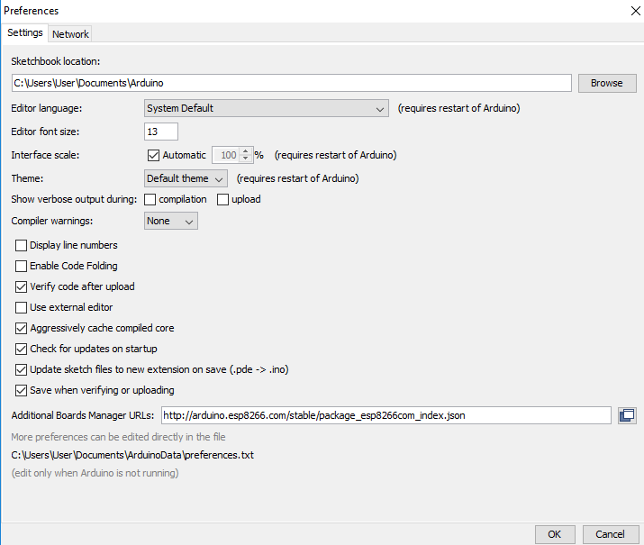
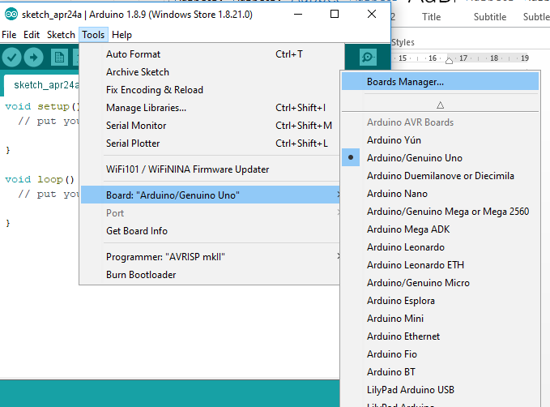
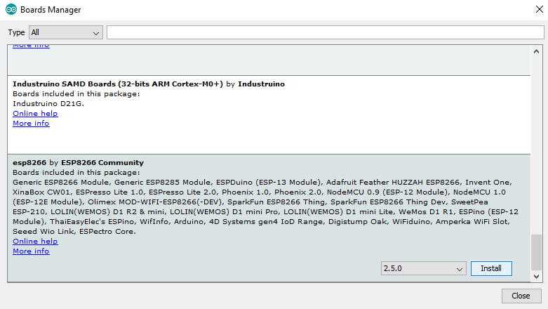
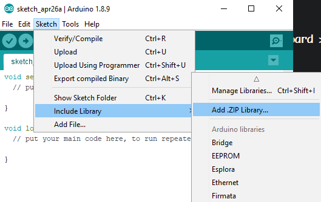

# Mikrokontroler

Berikut merupakan beberapa persyaratan Software yang perlu di-install sebelum mengikuti pelatihan:

### Arduino IDE
Untuk memprogram board mikrokontroler Arduino, diperlukan suatu IDE (Integrated Development Environment). IDE yang kita akan pakai pada kali ini adalah Arduino IDE yang dapat di-download di [link ini](https://www.arduino.cc/en/Main/Software).  
Pilih **Windows Installer** jika anda menggunakan Windows.

### ESP8266 untuk Arduino
ESP8266 untuk Arduino dapat di-install dengan membuka Arduino IDE dan navigasi ke **File > Preferences** Lalu tambahkan link berikut di kolom **Additional Boards Manager URLs**:  

`http://arduino.esp8266.com/stable/package_esp8266com_index.json`  

Install Board Untuk ESP8266 dengan navigasi ke **Tools > Board > Board Manager**, scroll ke paling bawah, lalu install ESP8266.

> Proses instalasi board ESP8266 membutuhkan koneksi internet, jadi pastikan anda terkoneksi ke internet sebelum menjalankan langkah berikut.

### Driver CH340
Silahkan download dan install driver CH340 di [link ini](https://sparks.gogo.co.nz/assets/_site_/downloads/CH34x_Install_Windows_v3_4.zip), lalu lakukan instalasi driver tersebut.

### Library FirebaseArduino dan ArduinoJson
FirebaseArduino dan ArduinoJson dibutuhkan untuk melakukan koneksi antara ESP8266 dengan Firebase. Shilahkan download masing-masing library berikut.
* [Firebase Arduino](https://github.com/FirebaseExtended/firebase-arduino/archive/v0.4rc1.zip)
* [ArduinoJson](https://github.com/bblanchon/ArduinoJson/archive/v5.13.5.zip)

Setelah download, navigasi ke **Sketch > Include Library > Add .ZIP Library...**, lalu pilih library yang telah di-download tadi.

